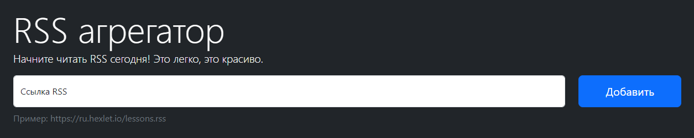

# RSS Aggregator

<h3><a href="https://frontend-project-11-kirills-projects-9df0e686.vercel.app/" target="_blank">Try it out on Vercel deploy</a></h3>



[](https://github.com/KirillTheStranger/frontend-project-11/actions)
[](https://github.com/KirillTheStranger/frontend-project-11/actions/workflows/tests&linter-check.yml)
[](https://codeclimate.com/github/KirillTheStranger/frontend-project-11/maintainability)

## Capabilities

It's a simple service to keep up to date with the latest news from your favorite feed. It automatically updating the feed every 5 seconds, so you won't miss any recent news.

## Installation

```
make install
make build
make develop
```
